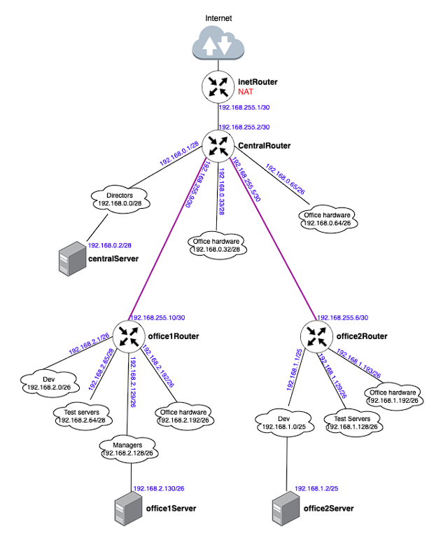

# LAN
## Архитектура сетей 
1. Скачать и развернуть Vagrant-стенд https://github.com/erlong15/otus-linux/tree/network;
2. Построить следующую сетевую архитектуру:
Сеть office1:

* 192.168.2.0/26 - dev
* 192.168.2.64/26 - test servers
* 192.168.2.128/26 - managers
* 192.168.2.192/26 - office hardware
  
Сеть office2:

* 192.168.1.0/25 - dev
* 192.168.1.128/26 - test servers
* 192.168.1.192/26 - office hardware
Сеть central:

* 192.168.0.0/28 - directors
* 192.168.0.32/28 - office hardware
* 192.168.0.64/26 - wifi
3. 
4. посчитаны данные по подсетям и подготовлена следующая таблица топологии сети:
  
5. Видим, что ошибок при планировании сети нет, а также о наличии свободных подсетей:
6. 
7.  Полная схема сети:
8. 
9. * На основании схемы получен список серверов:
 
* В соответствии со схемой в Vagrant-файл добавлены 4 новых сервера, кроме того, к старым серверам добавлены 2 дополнительных интерфейса для соединения сетей офисов.
* Настройка NAT на сервере inetRouter. Отключение фаервола ufw:
```
root@inetRouter:~# systemctl stop ufw
root@inetRouter:~# systemctl disable ufw
``` 
10. Установка пакета iptables-persistent для автоматического восстановления правил iptables и добавление необходимых правил фильтрации и NAT:
```
root@inetRouter:~# apt update; apt install iptables-persistent
...
root@inetRouter:~# apt list iptables-persistent
Listing... Done
iptables-persistent/jammy,now 1.0.16 all [installed]

root@inetRouter:~# nano /etc/iptables/rules.v4
...
root@inetRouter:~# cat  /etc/iptables/rules.v4
# Generated by iptables-save v1.8.7 on Tue Jul  9 08:34:37 2024
*filter
:INPUT ACCEPT [90:8713]
:FORWARD ACCEPT [0:0]
:OUTPUT ACCEPT [54:7429]
-A INPUT -p icmp -j ACCEPT
-A INPUT -i lo -j ACCEPT
-A INPUT -p tcp -m state --state NEW -m tcp --dport 22 -j ACCEPT
COMMIT
*nat
:PREROUTING ACCEPT [0:0]
:INPUT ACCEPT [0:0]
:OUTPUT ACCEPT [0:0]
:POSTROUTING ACCEPT [0:0]
-A POSTROUTING ! -d 192.168.0.0/16 -o enp0s3 -j MASQUERADE
COMMIT
# Completed on Tue Jul  9 08:34:37 2024
```
* Включение маршрутизации транзитных пакетов (форвардинг) на всех роутерах:
```
echo "net.ipv4.ip_forward = 1" >> /etc/sysctl.conf
sysctl -p 
```
* Отключение маршрута по-умолчанию на интерфейсе enp0s3. При разворачивании стенда, Vagrant создаёт в каждом сервере свой интерфейс, через который осуществляется доступ в Интернет. Отключить данный интерфейс нельзя, так как через него Vagrant подключается к серверам. Однако, можно отключить маршрут по умолчанию, прописанный на этот интерфейс. Отключение производится на всех хостах кроме inetRouter:
```
cat > /etc/netplan/50-cloud-init.yaml
---
network:
  ethernets:
    enp0s3:
      dhcp4: true
      dhcp4-overrides:
        use-routes: false
      dhcp6: false
  version: 2
  <ctrl+D>
```
* Добавление маршрутов по умолчанию на сервера centralServer, office1Router, office2Router, office1Server, office2Server:
```
root@centralServer:~# ip route add default via 192.168.0.1

root@office1Router:~# ip route add default via 192.168.255.9

root@office2Router:~# ip route add default via 192.168.255.5

root@office1Server:~# ip route add default via 192.168.2.129

root@office2Server:~# ip route add default via 192.168.1.1 
```
* Добавление на сервер centralRouter маршрутов к подсетям 192.168.1.0/24 и 192.168.2.0/24, а также маршрута по умолчанию:
```
root@centralRouter:~# ip route add default via 192.168.255.1

root@centralRouter:~# ip route add 192.168.1.0/24 via 192.168.255.6

root@centralRouter:~# ip route add 192.168.2.0/24 via 192.168.255.10 
```
* Добавление на сервер inetRouter маршрутов в каждую подсеть:
```
root@inetRouter:~# ip route add 192.168.1.0/24 via 192.168.255.2

root@inetRouter:~# ip route add 192.168.2.0/24 via 192.168.255.2

root@inetRouter:~# ip route add 192.168.0.0/24 via 192.168.255.2

root@inetRouter:~# ip route add 192.168.255.4/30 via 192.168.255.2

root@inetRouter:~# ip route add 192.168.255.8/30 via 192.168.255.2
```
* Проверка работоспособности развёрнутой инфраструктуры.
```
vagrant@office1Server:~$ ping -c 1 ya.ru
PING ya.ru (77.88.44.242) 56(84) bytes of data.
64 bytes from ya.ru (77.88.44.242): icmp_seq=1 ttl=57 time=350 ms

--- ya.ru ping statistics ---
1 packets transmitted, 1 received, 0% packet loss, time 0ms
rtt min/avg/max/mdev = 350.044/350.044/350.044/0.000 ms

vagrant@office1Server:~$ traceroute ya.ru
traceroute to ya.ru (77.88.44.242), 30 hops max, 60 byte packets
 1  _gateway (192.168.2.129)  0.227 ms  0.212 ms  0.205 ms
 2  192.168.255.9 (192.168.255.9)  0.417 ms  0.408 ms  0.568 ms
 3  192.168.255.1 (192.168.255.1)  0.668 ms  0.661 ms  0.780 ms
 4  10.0.2.2 (10.0.2.2)  0.771 ms  0.721 ms  0.740 ms
 5  * * *
 6  * * *
 7  * * *
 8  yandex-peers.crelcom.network (109.200.129.253)  35.393 ms  31.621 ms  31.575 ms
...

vagrant@office1Server:~$ ping -c 1 192.168.0.2
PING 192.168.0.2 (192.168.0.2) 56(84) bytes of data.
64 bytes from 192.168.0.2: icmp_seq=1 ttl=62 time=0.624 ms

--- 192.168.0.2 ping statistics ---
1 packets transmitted, 1 received, 0% packet loss, time 0ms
rtt min/avg/max/mdev = 0.624/0.624/0.624/0.000 ms

vagrant@office1Server:~$ ping -c 1 192.168.1.2
PING 192.168.1.2 (192.168.1.2) 56(84) bytes of data.
64 bytes from 192.168.1.2: icmp_seq=1 ttl=61 time=0.769 ms

--- 192.168.1.2 ping statistics ---
1 packets transmitted, 1 received, 0% packet loss, time 0ms
rtt min/avg/max/mdev = 0.769/0.769/0.769/0.000 ms
``` 
