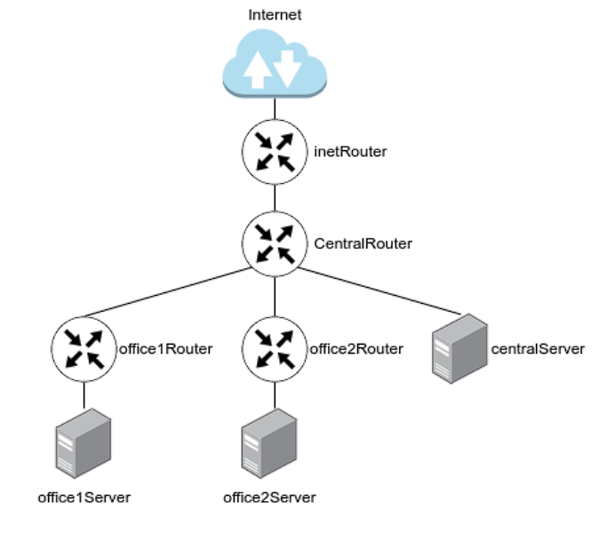

# LAN
## Архитектура сетей 
1. Скачать и развернуть Vagrant-стенд https://github.com/erlong15/otus-linux/tree/network;
2. Построить следующую сетевую архитектуру:
Сеть office1:

* 192.168.2.0/26 - dev
* 192.168.2.64/26 - test servers
* 192.168.2.128/26 - managers
* 192.168.2.192/26 - office hardware
  
Сеть office2:

* 192.168.1.0/25 - dev
* 192.168.1.128/26 - test servers
* 192.168.1.192/26 - office hardware
Сеть central:

* 192.168.0.0/28 - directors
* 192.168.0.32/28 - office hardware
* 192.168.0.64/26 - wifi
3. 
4. посчитаны данные по подсетям и подготовлена следующая таблица топологии сети:
  
5. Видим, что ошибок при планировании сети нет, а также о наличии свободных подсетей:
6. 
  
  
